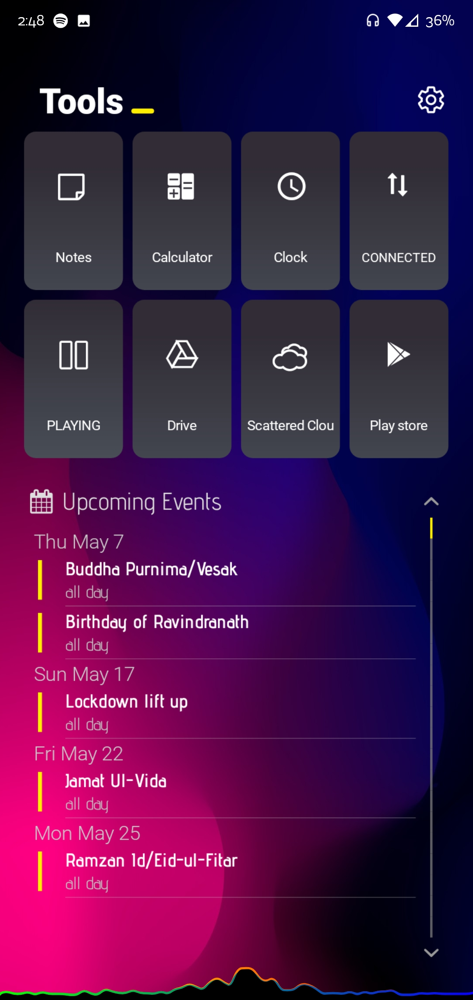

# android_rice

Contains a nice home screen setup along with widget rice and wallpaper... A sub-replica of Blloc's Ratio Launcher.

## Requirements

1. Nova Launcher (Prime)
2. KWGT (Pro)
3. Flight Icon Pack
4. Muviz (for visualizer near navbar)
5. CalendarProvider (some custom ROMs or skinned phones lack it)
And other general purpose apps as shown in the images. You may change the icon, app shortcut and name from KWGT itself as per your choice if you choose not to use that particular app/action.

## Images





## Installation

Download and install the above packages.
Clone this repository using the command
```
git clone https://github.com/probe2k/android_rice.git
```
Goto Nova Launcher Settings -> Backup & import settings -> Restore or manage backups -> Browse ```probe2kbackup.novabackup``` and click apply.

## Issues

If you got issues with specific tiles in the home/secondary screen, simply open kwgt widget manager, and on the widget handle, click on that particular tile and redefine the app/action for it.

## Disclaimer

I don't own this widget. I got it from an anonymous source with most of the parts not working for me. I modified the widgets with action controls and other configurations to make it work on my end. You might need to tune it accordingly for your phone depending on the applications installed and activity shortcuts supported.
